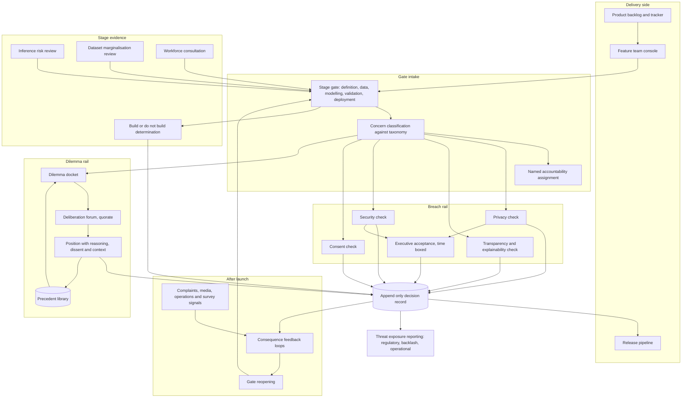

# Greylight

**Source:** `ai-in-ethics/deloitte-ai-ethics/`
**Domain:** `ai-ethics`
**One-liner:** A life-cycle review workflow for AI product teams that separates bright-line breaches, which block automatically, from genuine ethical dilemmas, which are routed to a named deliberation forum with a recorded position — so teams get an answer at each stage instead of an unresolved argument.
**Wedge:** AI feature delivery inside consumer-facing product organisations that ship 10–40 ai-enabled features a year — insurance claims and servicing, retail banking journeys, health service triage and scheduling, telecom care — where an ethics review already exists on paper and is routinely bypassed because nobody can say what passing looks like.
**Positioning:** A delivery-side ethics gate, not a compliance register. Assurance platforms answer a regulator's question about a deployed model; Greylight answers a product team's question this sprint: does this proceed, does it need deliberation, or is it barred — and if it is barred, on which of the four settled grounds. The source's own structural distinction between ethical *dilemmas*, which need argument, and ethical *breaches*, which are "better defined and generally accepted as obligatory," is the product's control flow, and its insistence that ethics management "cannot be a periodic, point-in-time exercise" is why a gate reopens after launch rather than closing.

## Market research synthesis

### Thesis from source

The paper's opening position is that AI is already here, that sitting it out is not an option, and that buying in requires far more than "lining up behind the hype or relying on limited-scale commitments and disconnected, proof-of-concept investments." What makes it useful as a product brief is its second position: that ethical implications must be considered throughout the life cycle of an AI application, and that executives will face genuine decisions "about how AI applications should be built, what values should be upheld, and whether they should be built in the first place." That final clause is the paper's most commercially consequential claim, because almost no delivery process has a formal place to record a decision not to build.

The paper then does something unusual — it separates the two publics whose questions must be answered. Members of the public are asking whether their role in the workforce will become obsolete, whether AI algorithms will make fair and unbiased decisions about them, how they can trust an output they do not understand, and whether their personal information will be used without consent. Executives, meanwhile, should be asking whether the intended use justifies the potential risks and public impact and whether the application should be built with AI at all; whether societal concerns including privacy and legal issues exist and how their impact will be minimised; whether proven assessment methods are in place to detect bias and ensure fairness; whether there is a clear and transparent method to scrutinise, interpret and explain the algorithm and its results; and whether the application is safe, the data protected, and the implications of a breach understood. Those two lists are not decoration — they are the actual question set a gate must ask, and they map to different evidence.

The core framework is a life cycle with ethics attached at every stage, wrapped in Strategy and Governance above and Risk and Control below, with value-aligned AI at the centre. Each stage carries its own question. At use case definition, "understanding your business problem means understanding the negative implications of solving it with AI" — how could your solution raise issues or concerns for you and your customers? At data acquisition and preparation, transparency in how data is collected and used enables more trustworthy results — do your results show the data collected marginalises certain demographics? At modelling and training, build while considering unwanted outcomes — is it possible to infer private or unintended information from the predictions? At validation, finalise the solution once results can be trusted. At deployment and monitoring, scale in a manner that respects internal operations — how will employees respond to increasing amounts of automation in the workplace? — and how do you plan to maintain a feedback loop to identify unintended consequences? The paper is explicit that most organisations are working on data privacy and unbiased datasets but that "these challenges are just the tip of the iceberg," and it names why the rest gets missed: "Ethical issues are often missed because of ambiguity about what ethics are and a lack of accountability about addressing them." Ambiguity and unassigned accountability are process defects, and process defects have product fixes.

The structured approach is three-pronged, and the second and third prongs are what make a workflow design possible. Governance and oversight comes first: setting the right controls and assessments, and embedding ethical AI at the very beginning so that all stakeholders are aligned on implications, risks and considerations. Ethical dilemmas come second — "the grey areas that require deep discussion focused on human values and perceptions of right and wrong," beginning with the fundamental question of whether an application should be enhanced by AI at all, then how to measure and ensure values such as fairness and safety, then how humans and machines will work together and how that collaboration will be planned. Ethical breaches come third, defined as "those violations of ethics that, despite also requiring discussion and contextualization, are better defined and generally accepted as obligatory," with four named areas where expectations are typically clear: privacy, where the entire data life cycle must be analysed for each potential privacy risk and corresponding control; transparency, where the organisation must be able to scrutinise and rationalise the technology and explain how the system arrived at a particular answer, so that users and regulators have assurance the tools perform as expected; security, where emerging technologies increase both exposure and reporting obligations; and consent, where data consent principles and standards must be defined, applied, enforced, and understood by the general population. A dilemma needs a forum; a breach needs a bright line. Conflating them is precisely how an ethics review becomes theatre.

Two further constraints shape the design. First, the paper stresses that ethics are contextual — "the perception of them depends in large part on geography, culture, social norms, organizational values and more" — which means a resolution reached for one market cannot be silently inherited by another, and a resolution has to carry the scope it was reached under. Second, it warns that "the management of AI ethics cannot be a periodic, point-in-time exercise. It requires continuous support and ongoing monitoring," and names three organisational threats that follow from failure: conflict with regulatory policies due to black-box solutions that do not provide the required level of transparency or explainability; public backlash arising from limited foresight on AI bias or limitations; and operational inefficiencies due to skewed or misunderstood predictions from ineffective datasets. Those three are the reporting lenses an executive sponsor will actually ask for, because each one has a different owner and a different remedy.

### Buyer & economic model

- **Primary buyer:** the AI risk leader who owns the escalation path, purchasing jointly with the Chief Product Officer or head of delivery who owns the release cadence. The paper's own organisation names an AI Risk Leader alongside an AI Strategy Leader, which is a fair signal of where this budget sits in practice.
- **Users:** AI product managers and feature owners submitting gates (per stage, weekly cadence), data scientists and ML engineers answering data and inference questions (per stage), the AI risk leader triaging the dilemma docket (daily), deliberation forum members including a legal representative, a privacy representative, a domain expert and an employee representative (per session), customer operations and service leads feeding post-launch signals (continuous), and the executive sponsor reading threat-exposure reporting (monthly).
- **Budget owner / value metric:** the delivery or transformation budget, not the compliance budget — which matters, because it makes cycle time the headline metric. The primary value metric is median days from gate submission to a recorded verdict, alongside the proportion of AI features reaching launch without an unrecorded ethical concern. Secondary metrics are the dilemma reuse rate (positions resolved once and reapplied rather than re-argued), the share of features with a named accountable owner for each open concern, and post-launch consequence signals caught by the feedback loop rather than by a customer complaint.
- **Competing status quo:** an ethics policy document plus an optional architecture review board, a privacy impact assessment template completed near launch, a security review that is genuinely gating, and an informal Slack escalation to whoever is senior enough to say no. The failure mode is not that teams behave badly; it is that a team with a legitimate grey-area question has no forum that returns an answer inside its sprint, so the question is dropped rather than escalated.

### Domain constraints

- **Regulatory / trust / safety:** the four breach domains carry hard external obligations — privacy law over the whole data life cycle, transparency and explainability sufficient for users and regulators to be assured the tools perform as expected, security incident reporting duties that widen as emerging technology is adopted, and consent standards that must be understood by the general population and not merely disclosed to it. Breach failures therefore cannot be voted away by a forum; the forum's authority extends to dilemmas and to compensating controls, not to waiving a bright line. Conversely, the platform must not pretend a dilemma is a rule: recording a forum's position, its reasoning, its dissent and its scope is the only honest output where the question is genuinely contested.
- **Data sensitivity:** gate submissions contain unreleased product plans and candid statements of anticipated harm, which is exactly the material an organisation is tempted to sanitise; the record must be safe enough to be honest in, which means access-scoped deliberation minutes and a clear position on what is discoverable. Inference-risk reviews describe how private attributes could be derived from model outputs and are therefore an attack roadmap if leaked. Workforce consultation responses about automation anxiety must be attributable enough to act on and protected enough that employees answer truthfully.
- **Change-management realities:** ethics review is the first thing dropped under delivery pressure, so the gate must be fast, must return a verdict rather than a homework list, and must be embedded in the workflow the team already uses. Because ethics are contextual, a multi-market organisation cannot operate one universal answer set; it needs the same question asked with a scope attached, which in turn requires a precedent library or the forum drowns. And because the paper's central warning is against point-in-time review, the product's hardest adoption problem is not the launch gate — it is keeping a feedback loop staffed and a named owner in place six months after the feature shipped and the team moved on.

## Business requirements

- BR-1: Every AI initiative must pass a recorded verdict at each life-cycle stage — use case definition, data acquisition and preparation, modelling and training, validation, and deployment and monitoring — and no initiative may progress to the next stage without one, so that "we never formally reviewed it" ceases to be a possible outcome.
- BR-2: The four settled breach domains — privacy, transparency, security and consent — must be evaluated as bright-line checks that block progression on failure and cannot be waived by any deliberation forum, only remediated or escalated to a named executive for a time-boxed acceptance.
- BR-3: The platform must support a formal decision not to build, taken at use case definition, with the reasoning retained as a durable organisational position, so that declining a use case is a recordable outcome rather than an absence of activity.
- BR-4: Grey-area questions must be raised as dilemmas onto a docket with a service commitment, and every dilemma must close with a recorded position, its reasoning, any dissent, and the named individuals who held it — a dilemma may be resolved either way, but it may not lapse unanswered.
- BR-5: Every ethical position must carry the context it was reached under — jurisdiction, market, customer segment and the organisational values invoked — and must not be automatically applied outside that scope, because the source is explicit that perception of ethics depends on geography, culture, social norms and organisational values.
- BR-6: Every open ethical concern must have exactly one named accountable individual, and the platform must report concerns without an owner as a governance failure in its own right, since the source identifies lack of accountability as a primary reason ethical issues are missed.
- BR-7: The organisation must maintain a defined vocabulary of ethical concern types, and every raised concern must be classified against it, so that ambiguity about what counts as an ethical issue stops being the reason issues go unrecorded.
- BR-8: Each launched AI feature must have a live consequence feedback loop with a named owner, a monitoring cadence and defined signals that reopen the deployment gate, and the platform must treat an unstaffed or stale loop as a control failure rather than as completed work.
- BR-9: Where an AI initiative materially changes how employees work, the platform must evidence a workforce consultation before deployment approval, capturing the anticipated response to increased automation and the mitigations agreed.
- BR-10: Model outputs must be reviewed for whether private or unintended attributes can be inferred from predictions, and datasets must be reviewed for whether their collection marginalises particular demographics, with both reviews recorded as evidence rather than as assertions.
- BR-11: Executive reporting must express the organisation's exposure across the three named threats — regulatory conflict arising from insufficient transparency or explainability, public backlash from limited foresight on bias or limitations, and operational inefficiency from skewed or misunderstood predictions — each with its own owner and remediation position.
- BR-12: Verdict cycle time must be measured and published as a service commitment, because a gate that cannot return an answer inside a delivery cycle will be bypassed, and a bypassed gate provides less protection than no gate at all.

## User stories

Canonical user stories live in sibling [USER_STORIES.md](USER_STORIES.md).

## System design

### Overview

Greylight wraps the AI delivery life cycle in five gates and routes every question raised at a gate down one of two rails. The breach rail evaluates the four settled domains — privacy, transparency, security, consent — against bright-line checks drawn from the organisation's obligations; a failure blocks progression and can only be cleared by remediation or by a named executive's time-boxed acceptance. The dilemma rail takes everything that a checklist cannot honestly settle and puts it on a docket with a service commitment, where a quorate deliberation forum returns a position with its reasoning, its dissent and — critically — the context it was decided under. Resolved positions become precedents that later initiatives can inherit only inside that context, which is what keeps the forum's workload finite in a multi-market organisation. At use case definition the gate can return a build or do-not-build determination, and that determination is retained as a durable position rather than as a closed ticket. After launch the gate does not close: each feature carries a consequence feedback loop with a named owner, a cadence and defined reopening signals, so that a monitored consequence signal can return a live feature to deliberation. Everything raised is classified against a maintained concern vocabulary and assigned to one named individual, because the source identifies ambiguity and unassigned accountability as the two mechanisms by which ethical issues are missed.

### Actors & boundaries

- **Actors:** AI product managers and feature owners, data scientists and ML engineers, the AI risk leader who chairs escalation, deliberation forum members drawn from legal, privacy, security, domain expertise and employee representation, customer operations and service leads supplying post-launch signals, the executive sponsor who may accept a breach for a bounded period, internal audit as a reader, and — as the subjects whose interests the gate exists to represent — customers and employees, present through consultation and complaint signals rather than as users.
- **Trust boundary:** Greylight governs the decision, not the model. It holds submissions, checks, verdicts, positions and signals; it does not hold training data, model weights or production inference. The deliberation record is access-scoped so that candid statements of anticipated harm remain safe to write, and inference-risk reviews are held under tighter access than the rest of a submission because they describe how to derive private attributes from outputs. Workforce consultation responses are aggregated before they reach the initiative record so that consultation does not become surveillance of the people consulted. Verdicts and forum positions are append-only: a position can be superseded by a later position, never edited.
- **Human-in-the-loop points:** the gate verdict itself at every stage; the build or do-not-build determination at use case definition; deliberation and position-setting by a quorate forum; dissent recorded by an individual member; breach acceptance signed by a named executive with an expiry; consequence-loop ownership accepted by a named individual; and the decision to reopen a deployment gate on a monitored signal.

### Core capabilities

1. **Life-cycle gating** — five stage gates with stage-specific question sets, verdicts of proceed, proceed with conditions, deliberate or barred, and enforced progression order.
2. **Breach checks** — bright-line evaluation across privacy, transparency, security and consent, with blocking failures, remediation tracking and executive acceptance as the only alternative path.
3. **Build determination** — a first-class record of whether the use case should be enhanced by AI at all, retained as an organisational position.
4. **Dilemma docket** — intake, classification, severity and launch-date ordering, service commitments and escalation on breach of commitment.
5. **Deliberation forum** — quorum rules, session records, positions with reasoning, recorded dissent and attached conditions.
6. **Context scoping** — jurisdiction, market, customer segment and invoked organisational values attached to every position, with alerts when a position is applied outside its scope.
7. **Precedent library** — resolved positions reusable within context, with review dates so an inherited answer expires rather than ossifying.
8. **Concern taxonomy and accountability** — maintained vocabulary of concern types, mandatory classification, and one named accountable owner per open concern.
9. **Inference and marginalisation reviews** — recorded assessment of what private or unintended attributes are derivable from predictions, and whether data collection marginalises particular demographics.
10. **Workforce consultation** — structured pre-deployment consultation where an initiative changes how employees work, with aggregated responses and agreed mitigations.
11. **Consequence monitoring** — per-feature feedback loops with named owners, cadences, defined signals and automatic reopening of the deployment gate.
12. **Threat exposure reporting** — portfolio reporting across regulatory conflict, public backlash and operational inefficiency, each with owner and remediation position.

### Conceptual data

- **Primary entities:** AiInitiative, LifecycleStage, StageGate, GateSubmission, GateVerdict, BreachCheck, BreachCheckResult, BreachAcceptance, BuildDetermination, Concern, ConcernTaxonomyTerm, Dilemma, DeliberationSession, ForumPosition, DissentRecord, ContextScope, Precedent, InferenceRiskReview, MarginalisationReview, WorkforceConsultation, ConsequenceLoop, ConsequenceSignal, ThreatExposure, AccountableOwner.
- **Critical events:** initiative registered, gate submitted, breach check failed or cleared, breach accepted and expired, build determination recorded, concern raised and classified, concern owner assigned or vacated, dilemma docketed, service commitment breached, deliberation session held, position recorded with dissent, precedent inherited, position applied out of scope, verdict issued, stage progressed, workforce consultation completed, feature launched, consequence signal received, feedback loop gone stale, deployment gate reopened, position superseded.
- **Retention / audit needs:** verdicts, positions and dissent retained append-only for the life of the feature plus the organisation's litigation and regulatory window, reconstructable against the taxonomy and quorum rules that applied on the decision date. Deliberation minutes retained under restricted access with a defined disclosure position. Inference-risk reviews retained under tighter access control and excluded from broad internal search. Workforce consultation responses retained in aggregate only, with individual responses held briefly and then discarded. Consequence signals retained long enough to establish trend, with any personal data in a complaint signal replaced by a reference to the originating case system.

### Integrations (conceptual)

- **Systems of record:** the product delivery backlog and issue tracker where initiatives already live, the design and documentation system holding intended-use descriptions, the privacy management platform for impact assessments feeding the privacy breach check, the security review and vulnerability systems feeding the security check, the consent management platform feeding the consent check, and the HR system for reporting lines, forum membership and employee representation.
- **Upstream signals:** release events indicating a stage transition, model evaluation results relevant to the transparency check, customer complaint and contact-centre themes, ombudsman and regulator correspondence, social listening and media monitoring for backlash indicators, employee engagement survey items relating to automation, and dataset composition statistics from the data platform.
- **Downstream actions:** gate state published to the delivery pipeline so a barred initiative cannot progress, dilemma items created in the forum's calendar with papers attached, conditions written back to the initiative as delivery requirements, feedback-loop tasks assigned to named owners with recurring cadence, executive reporting packs, and reopened gates raised as work items on the owning team's backlog.

### High-level architecture

Two rails and a loop. Submissions enter a stage gate; deterministic breach checks and human-judgement dilemmas split immediately; verdicts and positions land in one append-only decision record; the record gates delivery and seeds the precedent library. After launch, monitored signals flow back into the same record and can reopen the deployment gate.

### Success metrics

- **Leading:** median and 90th-percentile days from gate submission to recorded verdict, by stage; share of AI initiatives with a verdict at every stage they have passed; dilemma docket age and share breaching service commitment; precedent inheritance rate, measured as dilemmas closed by an existing in-scope position rather than by a new deliberation; proportion of open concerns with a named accountable owner; share of launched features with a live, in-cadence consequence loop; number of positions detected in use outside their recorded context; workforce consultations completed before deployment approval where the initiative changes how employees work.
- **Lagging:** AI features launched with no unrecorded ethical concern subsequently identified; consequence signals caught by the feedback loop before appearing as a customer complaint, regulator query or media story; do-not-build determinations recorded, as evidence that the gate can actually say no; reversal rate on positions, which distinguishes a forum that is deciding from one that is deferring; regulatory findings citing insufficient transparency or explainability; adverse public incidents attributable to bias or limitations that a foresight review had not considered; and rework cost avoided by concerns raised at use case definition rather than at validation.

## OpenAPI skeleton

Canonical HTTP surface lives in sibling [openapi.yaml](openapi.yaml). Summary:

- **Base path:** `/v1/...`
- **Auth:** `X-API-Key` for machine integration from the delivery tracker, privacy, security and consent systems and signal feeds; Bearer JWT for console users, whose role determines whether they may submit, check, deliberate, hold a position, accept a breach or only read.
- **Resource groups:** Initiatives, Stage Gates, Breach Checks, Build Determination, Dilemmas, Deliberation, Precedents, Reviews, Workforce, Consequence Monitoring, Taxonomy, Reporting.
