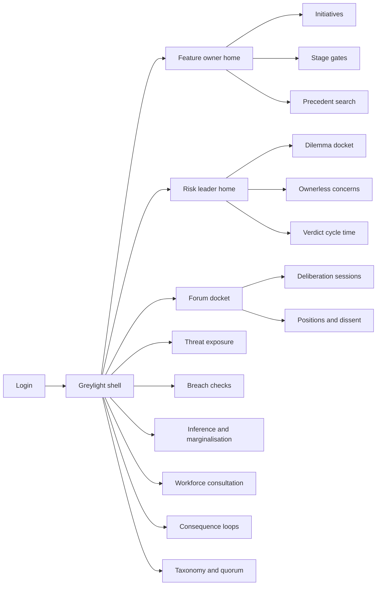
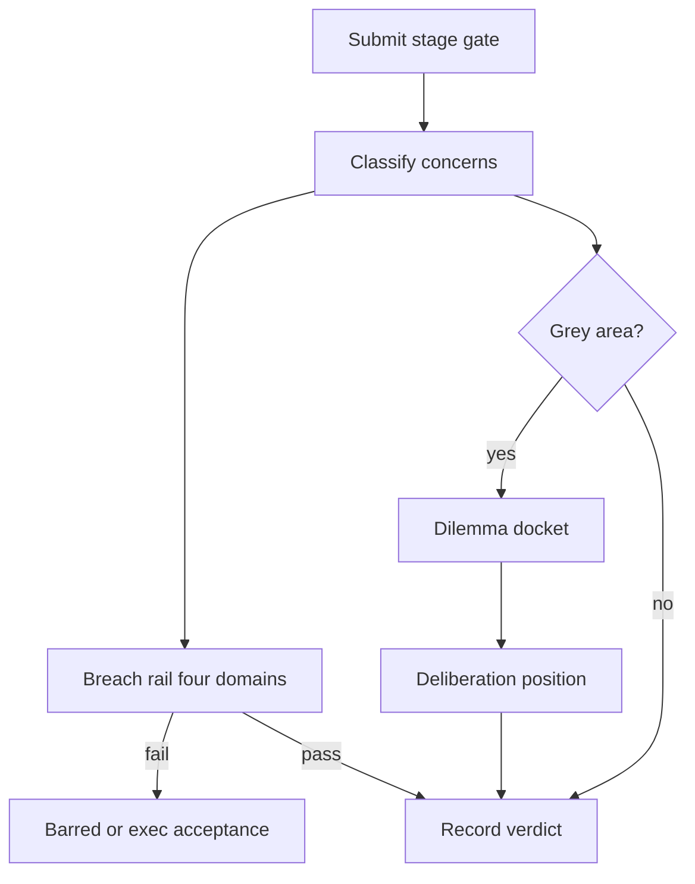

# Greylight — Web app

**Product:** [PRODUCT.md](./PRODUCT.md)
**Primary surface:** Delivery-side ethics gate console (feature owners, risk leader, deliberation forum, consequence-loop owners)
**Secondary surfaces:** Forum session room (quorum-gated deliberation); precedent library browser (context-scoped inheritance); executive threat-exposure pack (read-oriented monthly)
**Design thesis:** Greylight is a sprint gate that separates bright lines from grey rooms — not a second-line clearance vault and not a policy wiki. The metaphor is a dual-rail switchyard at dusk: hard red stop for privacy/transparency/security/consent breaches; amber track into a named forum that must return a position with dissent and jurisdiction stamped on it. Visual language is graphite night with a single tungsten filament accent (the “verdict light”); when the light is off, the feature does not move. The product’s spirit — dilemmas need argument, breaches are obligatory — is the interaction model, not a slogan.

## UX research synthesis

### Category peers (best-in-class)

- **Linear (issue lifecycle):** Explicit states, cycle-time as a first-class metric, “blocked vs ready” without homework dumps. Steal: proceed / deliberate / barred as crisp verdict chips and published SLA on time-to-verdict; reject Linear’s engineering-only vocabulary where Greylight needs ethics taxonomy and forum quorum.
- **Architecture Decision Records (ADR) practice / Log4brains-style ADR UIs:** Decision, context, consequences, supersession. Steal: positions as durable organisational memory with scope and review dates; reject free-form wiki sprawl without mandatory dissent and named holders.
- **GitLab / GitHub required checks + CODEOWNERS:** Blocking checks vs advisory review; cannot merge past hard fails. Steal: breach rail as non-waivable by forum; executive acceptance as the only alternate path with expiry; reject treating ethics as optional “label.”
- **Microsoft Responsible AI Impact Assessment worksheets:** Stage-tied question sets across the ML lifecycle. Steal: stage-specific prompts (definition → data → modelling → validation → deployment); reject static PDF worksheets as the runtime product.

### Patterns to adopt / reject

- **Adopt:** Five life-cycle gates with enforced order; dual rail (breach vs dilemma) visible on every submission; proceed / proceed-with-conditions / deliberate / barred / do-not-build as finite verdicts; context stamp (jurisdiction, market, segment, values) on every position; precedent inheritance only in-scope; named owner mandatory on every open concern; consequence loop as post-launch control that can reopen deployment; cycle-time dashboard for the gate itself (BR-12).
- **Reject:** Single “ethics score”; forum voting away a privacy breach; silent cross-market reuse of positions; point-in-time checkbox that closes forever at launch; Attestra-style lawful-basis clearance seals as the hero (wrong product); purple AI halo; cream compliance brochure.

### Trust, density, and workflow constraints from PRODUCT.md

Gates that cannot answer inside a sprint get bypassed (BR-12) — UI must return a verdict, not a reading list. Bright lines cannot be waived by deliberation (BR-2). Ethics are contextual — out-of-scope application must alert (BR-5). Candid anticipated-harm text needs access-scoped minutes; inference-risk reviews are attack roadmaps if leaked (domain constraints). Post-launch: unstaffed consequence loops are control failures, not “done” (BR-8).

## Information architecture

### Nav model

### Roles → default home

| Role | Default home | Why |
|------|--------------|-----|
| Feature owner / AI PM | Owner home — next gate + blockers | Sprint cadence (stories) |
| Data scientist / ML engineer | Active stage evidence (reviews) | Data/modelling questions |
| AI risk leader | Dilemma docket by launch + severity | Scarce forum time (BR-4) |
| Forum member / employee rep | Upcoming sessions | Deliberation prep |
| Consequence-loop owner | Live loops due this cadence | Post-launch control (BR-8) |
| Executive sponsor | Threat exposure + acceptances | Three threat lenses (BR-11) |
| Platform admin | Taxonomy and quorum versions | Reconstructability |

### Cross-links to OpenAPI resources

| Nav area | OpenAPI tags / resources |
|----------|---------------------------|
| Initiatives | Initiatives |
| Stage gates / verdicts | Stage Gates |
| Bright-line checks | Breach Checks |
| Do-not-build | Build Determination |
| Dilemma docket | Dilemmas |
| Forum sessions / positions | Deliberation |
| Context-scoped reuse | Precedents |
| Inference / marginalisation | Reviews |
| Employee consultation | Workforce |
| Post-launch reopen | Consequence Monitoring |
| Concern vocabulary | Taxonomy |
| Threats and cycle time | Reporting |

## Screen inventory

### Feature owner home

- **Purpose:** Answer “what is my next gate verdict, and can I ship this sprint?”
- **Entry:** Default for delivery roles.
- **Layout regions:** Tungsten verdict light for each owned initiative; stage progress rail (five stages); blockers split by breach vs dilemma; in-scope precedents suggested; cycle-time commitment vs actual.
- **Primary actions:** Submit current stage; open barred remediation; record do-not-build; inherit precedent.
- **Empty / loading / error:** Empty = register initiative from backlog sync; error = retry with request id.
- **BR / story ties:** BR-1, BR-12; feature owner stories.

### Initiative and stage gate workspace

- **Purpose:** One initiative’s life-cycle spine with stage-specific question sets and enforced progression.
- **Entry:** Initiatives nav; deep link from tracker.
- **Layout regions:** Stage tabs; submission pane (anticipated harm in team’s words); dual-rail status strip; verdict history (append-only); accountable owners for open concerns.
- **Primary actions:** Submit gate; attach evidence; progress stage when verdict allows.
- **Empty / loading / error:** Attempt to skip stage = hard block; no verdict = cannot progress.
- **BR / story ties:** BR-1, BR-6, BR-7.

### Breach check board

- **Purpose:** Evaluate privacy, transparency, security, consent as bright lines that block — forum cannot waive.
- **Entry:** From stage submission; Breaches nav.
- **Layout regions:** Four domain columns; pass/fail with evidence; remediation tracker; executive acceptance drawer (named, time-boxed) as only alternate path.
- **Primary actions:** Run/record check; remediate; request acceptance; challenge misapplied check (exception).
- **Empty / loading / error:** Fail = red stop on stage; acceptance expiry returns fail automatically.
- **BR / story ties:** BR-2; engineer exception story.

### Build determination

- **Purpose:** First-class record of whether to enhance with AI at all — including durable do-not-build.
- **Entry:** Use-case definition stage; dedicated CTA.
- **Layout regions:** Determination form; reasoning retained; link to roadmap visibility (“work we chose not to do”); supersession if revisited.
- **Primary actions:** Record build / do-not-build; export position.
- **Empty / loading / error:** Missing determination blocks leaving definition stage.
- **BR / story ties:** BR-3.

### Dilemma docket

- **Purpose:** Grey-area questions ordered by launch date and severity with service commitment clocks.
- **Entry:** Risk leader default.
- **Layout regions:** Docket table; commitment SLA meter; classification against taxonomy; owner column; out-of-scope application alerts.
- **Primary actions:** Docket dilemma; escalate SLA breach; schedule forum; apply in-scope precedent.
- **Empty / loading / error:** Empty = “no open grey areas”; lapse unanswered forbidden — ageing items pulse amber then coral.
- **BR / story ties:** BR-4, BR-5, BR-7, BR-12.

### Deliberation session room

- **Purpose:** Quorate forum returns a position with reasoning, dissent, conditions, and context stamp.
- **Entry:** Calendar/session from docket.
- **Layout regions:** Quorum indicator; paper (anticipated harm, affected group); live position draft; dissent lane; context fields (jurisdiction, market, segment, values); conditions attach.
- **Primary actions:** Record position; register dissent; attach conditions; close session.
- **Empty / loading / error:** Below quorum = cannot close with binding position; access-scoped minutes banner.
- **BR / story ties:** BR-4, BR-5; forum member stories.

### Precedent library

- **Purpose:** Reuse resolved positions only inside recorded context; review dates prevent ossification.
- **Entry:** Owner home suggestions; Precedents nav.
- **Layout regions:** Search by concern type + market; context match score; inheritance action; out-of-scope warning; review-due list.
- **Primary actions:** Inherit; request re-deliberation; flag misuse.
- **Empty / loading / error:** No in-scope match = route to docket, not silent copy.
- **BR / story ties:** BR-5; feature owner inheritance story.

### Inference and marginalisation reviews

- **Purpose:** Evidence whether predictions leak private/unintended attributes and whether data collection marginalises demographics.
- **Entry:** Data and modelling stages; Reviews nav.
- **Layout regions:** Dual review panes; tighter-access badge on inference-risk; evidence attachments; gate checklist ticks.
- **Primary actions:** Complete review; restrict visibility; link to transparency breach check.
- **Empty / loading / error:** Missing reviews block validation stage.
- **BR / story ties:** BR-10.

### Workforce consultation

- **Purpose:** Pre-deployment evidence of employee response to automation with aggregated mitigations.
- **Entry:** Deployment stage when work-change flag set.
- **Layout regions:** Consultation status; aggregated themes (no individual surveillance); agreed mitigations; employee-rep attestation.
- **Primary actions:** Launch consultation; record mitigations; approve for deployment gate.
- **Empty / loading / error:** Required but missing = barred at deployment.
- **BR / story ties:** BR-9.

### Consequence feedback loops

- **Purpose:** Post-launch monitoring with named owner, cadence, signals that reopen deployment gate.
- **Entry:** After launch; Loops nav; signal integrations.
- **Layout regions:** Loop roster; cadence health; signal inbox; reopen actions writing back to backlog; stale-loop control failure banner.
- **Primary actions:** Accept ownership; acknowledge signal; reopen gate; reassign stale owner.
- **Empty / loading / error:** Unstaffed loop = governance failure state, not green “complete.”
- **BR / story ties:** BR-8.

### Threat exposure reporting

- **Purpose:** Executive view across regulatory conflict, public backlash, operational inefficiency — each with owner and remediation.
- **Entry:** Exec default.
- **Layout regions:** Three threat compositions (one job each section); owner columns; breach acceptances ageing under sponsor name; cycle-time service health.
- **Primary actions:** Export pack; drill to initiatives; renew/expire acceptances.
- **Empty / loading / error:** Unowned threat slice highlighted as failure.
- **BR / story ties:** BR-11, BR-12.

### Taxonomy and quorum admin

- **Purpose:** Versioned concern vocabulary and forum quorum rules so past verdicts remain interpretable.
- **Entry:** Admin nav.
- **Layout regions:** Taxonomy editor; quorum rules; version timeline; impact preview on open dilemmas.
- **Primary actions:** Publish version; deprecate term; set quorum.
- **Empty / loading / error:** Unpublished draft cannot be used on live gates.
- **BR / story ties:** Admin story; BR-7.

## Key flows

1. **Stage gate to verdict** — submit stage → classify concerns → run breach rail + optional dilemma rail → verdict (proceed / conditions / deliberate / barred); failure: unanswered dilemma or failed breach.

2. **Do-not-build at definition** — raise harm foresight → determination do-not-build → durable position retained → roadmap shows deliberate non-build.

3. **Precedent inheritance** — search library → context match → inherit within scope → alert if later applied out of scope.

4. **Post-launch reopen** — signal fires → loop owner acknowledges → deployment gate reopens → stage re-enters deliberation or breach remediation.

5. **Misapplied breach challenge** — engineer contests check → risk leader reviews → check corrected or upheld → no silent bypass.

## Design system

### Tokens (CSS variables)

- `--color-ink: #E7E4DF` — text on night ground
- `--color-night-950: #12141A` — app ground
- `--color-night-900: #1A1E28` — panels
- `--color-graphite: #2A303C` — rails and dividers
- `--color-tungsten: #E8C547` — verdict light / proceed accent
- `--color-tungsten-dim: #8A7320` — tungsten on dark
- `--color-rail-breach: #D94A3D` — bright-line stop
- `--color-rail-dilemma: #E39B2E` — grey-area / deliberate track
- `--color-rail-clear: #3D8F6E` — proceed
- `--color-fog: #9AA3B2` — secondary labels
- `--color-session: #243044` — deliberation room surface
- `--font-display: "Fraunces", serif` — verdict headlines and do-not-build titles only
- `--font-body: "Satoshi", sans-serif` — console (expressive, not Inter)
- `--font-mono: "JetBrains Mono", monospace` — gate ids, taxonomy versions, SLA clocks
- `--space-1`…`--space-8`: 4px scale
- `--radius-sm: 4px`; `--radius-md: 8px`
- `--motion-verdict: 220ms ease-out` — tungsten light settle
- `--motion-sla: 300ms ease-in-out` — docket commitment pulse
- `--motion-reopen: 180ms ease-in` — gate reopen flash
- Atmosphere: dusk switchyard — soft top vignette, dual-rail motif in chrome, no stock ethics photography; deliberation room slightly lifted fog panel.

### Typography & brand

- Fraunces for verdict and build-determination moments; Satoshi for dense delivery UI.
- Brand “Greylight” as the chrome mark beside the verdict light — brand-first on login: one headline (“Proceed, deliberate, or barred”), one line on dual rails, one CTA.
- Never let a generic “Ethics Dashboard” outrank the brand or the stage gate.

### Do / don’t

- **Do:** Show breach vs dilemma rails explicitly; stamp context on every position; require named owners; keep consequence loops staffed; publish gate cycle time.
- **Don’t:** Let forums waive bright lines; silent cross-market precedent copy; purple AI scores; forever-closed launch checkboxes; card grids for static policy; emoji “ethics approved.”

### Accessibility & domain trust cues

- Colour never sole signal: verdict text + icon + tungsten state.
- Live regions for SLA breaches, gate reopens, acceptance expiry.
- Inference-risk surfaces announce restricted access; workforce views show aggregate-only.
- Focus order: stage questions → breach → dilemma → verdict.

## Component patterns

- **VerdictLight** — proceed / conditions / deliberate / barred / do-not-build.
- **DualRailStrip** — breach domains vs dilemma status on one submission.
- **StageProgressRail** — five life-cycle stages with lock until verdict.
- **DilemmaSlaChip** — service commitment countdown.
- **ContextStamp** — jurisdiction / market / segment / values on positions.
- **PrecedentMatchCard** — in-scope inheritance affordance (interaction container).
- **DissentLane** — recorded disagreement without forcing false consensus.
- **ConsequenceLoopHealth** — owner, cadence, stale failure.
- **ThreatTripleBoard** — regulatory / backlash / operational exposure.
- **TaxonomyVersionBadge** — rules-as-of for historical verdicts.

## Out of scope for v1 web

- Model training notebooks; production inference monitoring as MLOps; regulator-facing clearance dossiers (assurance products); public consumer ethics portal; native mobile; replacing Jira/Linear as the backlog system of record (integrate, don’t clone).
